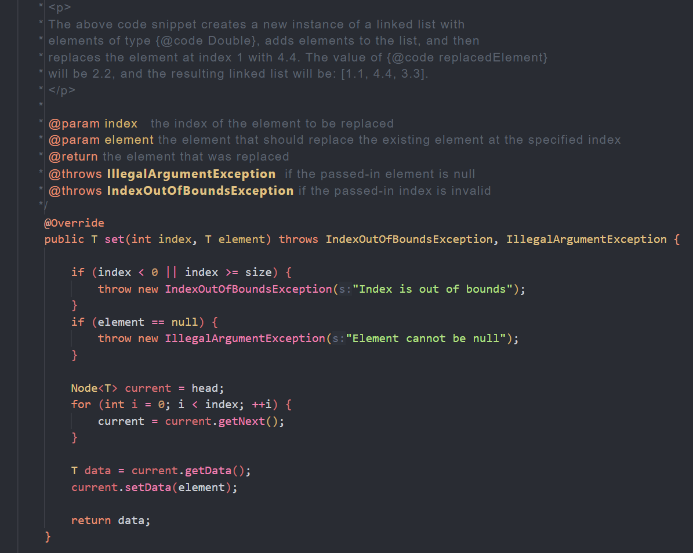

# InkaChroma Dark

[](https://vscode.dev/editor/theme/InkaChromaDark.inkachroma-dark) 


InkaChroma Dark is a Visual Studio Code theme that draws inspiration from the renowned One Dark Theme. While retaining the clean and sophisticated design of One Dark, InkaChroma Dark introduces subtle color changes and other adjustments, creating a unique and visually appealing coding environment.



## Installing

This extension is available for free in the [Visual Studio Code Marketplace](https://marketplace.visualstudio.com/items?itemName=InkaChromaDark.inkachroma-dark)  

## What's new?

Click here to go to the [Changelog](https://github.com/Falaxsa13/InkaChroma/blob/master/CHANGELOG.md)


## Customization

### Custom Font

InkaChroma Dark supports custom fonts to enhance your coding experience. Follow these steps to change the font:

1. Open Visual Studio Code.
2. Navigate to File > Preferences > Settings or use `Ctrl + ,` (`Cmd + ,` on macOS).
3. Click on the "Open Settings (JSON)" icon in the top-right corner of the settings page.
4. Add the following configuration to set your desired font:

```json
{
  "editor.fontFamily": "Your Custom Font, 'Other Font', sans-serif",
  "editor.fontSize": 14,
}

```

## Custom Font for Comments

Visual Studio Code doesn't have a tool to change the font of specific components. If you want to have the Screenshot font for comments, follow these steps:

[Related StackOverflow Discussion](https://stackoverflow.com/questions/49148581/how-do-i-change-font-of-comments-in-visual-studio-code-id)

1. Navigate to the root of your VS Code installation. On a Mac, this is typically `Users/username/.vscode/`.
2. In the terminal, navigate to this directory and create the custom stylesheet by running the command:

   ```bash
   touch style.css

3. Open the created style.css file.

4. Identify the class for comments by opening Dev Tools within VS Code. Hover over a comment to see the class (e.g., .mtk3).

5. Add your custom style rules to the style.css file. For example:

```css
.mtk3 {
   font-family: "iosevka";
   font-size: 1em;
   font-style: italic;
}
```

### Link to Your Stylesheet

6. Open settings.json for VS Code (the global file, not project-specific ones).

7. Add the following entry to inform VS Code about the stylesheet:

```json
"vscode_custom_css.imports": ["file:///Users/username/.vscode/style.css"],
```
Replace the path with your own, and be aware of the correct file URL format for Windows.


### Install the Plugin

8. Install the "Custom CSS and JS Loader" plugin.

9. Use the command palette (Cmd+Shift+P) and type 'Enable custom CSS and JS'. Select the option that appears.

10. Restart VS Code or run "Reload Window" to apply the custom styles.

<br style="line-height: 3em;">

Please note that the cursor behavior might be slightly erratic, but it should not significantly impact your experience since comments are typically written less frequently than code. Feel free to share insights on targeting additional mtk classes in the comments if you discover more about the behavior.